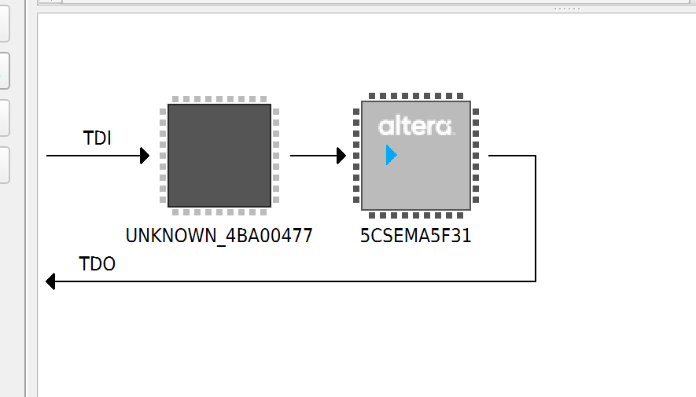

## Steps to prepare a demo on a Altera/Terasic DE1-SOC

Install Quartus (Latest, Lite is fine)

You can try to install the .sof file right away, if it works.

If you need to rebuild the project:
- Use dino_quartus_demo_top.v as your top file.
- Add all the files in /src into the project
- Compile 

Tools -> Programmer 
- Connect to the board (make sure it is powered) with a USB / USB-B connection, into the USB-Blaster-II connection beside the power connection
- Make sure you have the drivers and that the hardware says DE-SoC
- If it doesn't, Hardware Setup -> Currently Selected Hardware -> DE-SoC
- Press Auto-detect
- 
- Press start to program the board with the bitstream

Usage:
- The rightmost switch (SW0) is currently configured as the AI/Manual toggle
SW0: Up = manual, Down = AI
Key3 (button) -> Up
Key2 (button) -> Down
Key0 (button) -> reset
